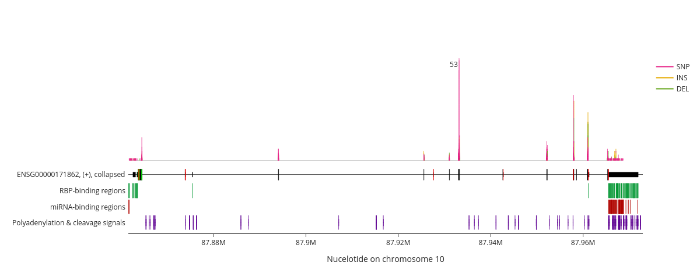

# VARIANT_VISUALIZER



> README is work in progress!

Visualizing genomic regions, transcripts and proteins, their known functional regions, regulatory elements and the mutations affecting them.

## Setup

### Prepare config.yml

At a minimum, the following values need to be defined in the `config.yml` (general section):
- `init_bedtools`: Bash command that enables use of the `bedtools` command in the command line.
- `ucsc_liftover`: Path of the UCSC-Liftover executable.

### Prepare conda enviroment

Create conda enviroment:
```bash
conda env create -f conda_environment.yml
```
Activate the enviroment:
```bash
conda activate variant_visualizer
```

### Download dependencies

Run `setup_dependencies.py`. The script automatically downloads all dependencies not mentioned in the previous step and prepares them for further use.

```bash
python setup_dependencies.py
```

### Generate clusters

#### All clusters

Generate genomic clusters by running `setup_clusters.py` passing the number of parallel processes as argument.
Generating all clusters is currently very resource intensive. For each parallel process, 20 GB of memory are advised. Use as many parallel processes as you can afford. This will allow you to visualize any gene/transcript/protein.

```bash
python setup_clusters.py --n_processes 1
```

#### A selection of clusters

If you wish to prepare the package for plotting a set of specific genes and you are using the default input files that were automatically prepared in the previous step, you can download a pre-generated index and query genes and transcript to find out which clusters you need to set up.

> missing description of enabling default index
```python
import variant_visualizer as vv
index = vv.clusters.load_index('pre-generated')
pten_cluster = index.query_gene_name('PTEN')
print(pten_cluster) # 3175
```

This command only calculates the cluster which includes the gene PTEN, allowing you to reproduce examples shown in `vignette.ipynb`:

```bash
python setup_clusters.py --n_processes 1 --cluster_ids 3175
```

### Set up the ClusterIndex

If you have generated clusters and you do not wish to rely on the pre-generated index, run `setup_index.py` to generate an index including all clusters that were generated in the previous step. Re-run the script to update the index if new clusters were generated.

```bash
python setup_index.py
```

## Usage

Read `vignette.ipynb` for exampels and detailed explaination on how this package can be used. 